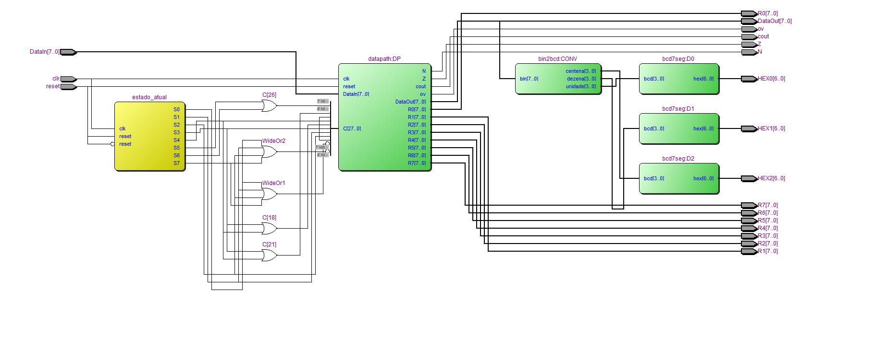
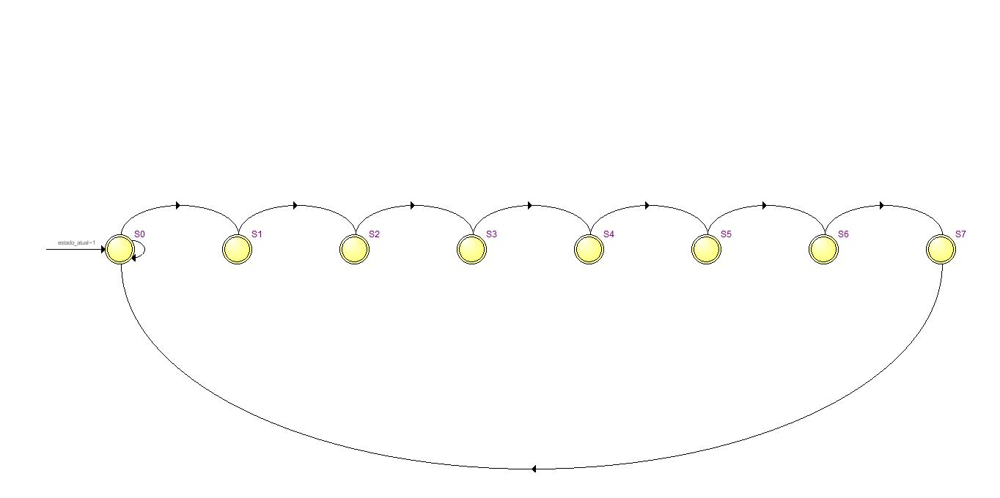
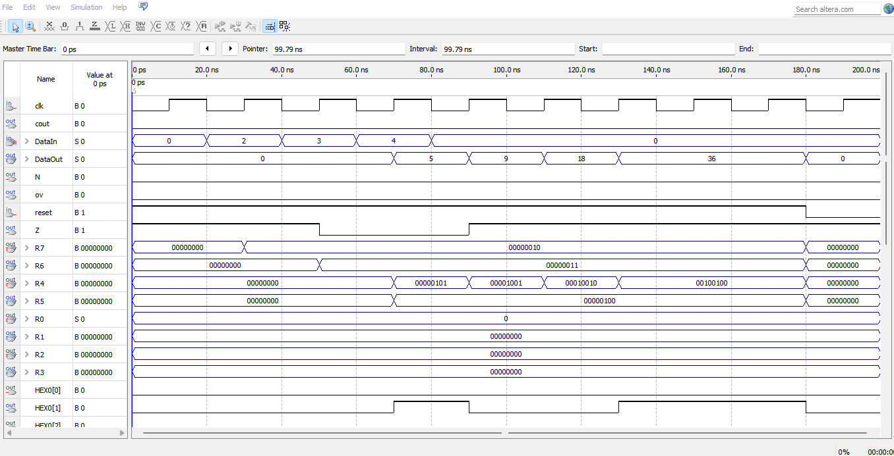

# 4x-the-edges 📦⚡

<p align="center">
  
  
  
  
  
</p>

<p align="center">
  <b>A finite-state machine that does 3rd-grade geometry in hardware.</b><br/>
  Feed it three numbers, it hands you back <code>4 × (a + b + c)</code> — the total edge length of a rectangular box — computed cycle by cycle on real silicon logic.
</p>

---

## 🧠 The idea

A rectangular box has 12 edges: 4 of each dimension. So:

```
sum_of_edges = 4 × (height + width + length)
```

Trivial in software. The fun part here is doing it the **hardware way**: no CPU, no instructions — just a custom control unit (FSM) driving a custom datapath, register by register, clock edge by clock edge.

## 🔩 How it's built

A classic **control unit + datapath** split:

- **Datapath** — 8× 8-bit registers, an ALU (add/sub), a shifter, and a pile of muxes routing everything.
- **Control unit (FSM)** — an 8-state machine that outputs the control word for each clock cycle.

```
R7 <- DataIn                      -- height
R6 <- DataIn                      -- width
R5 <- DataIn, R4 <- R7 + R6       -- length is read WHILE R7+R6 is computed — same cycle, free speed-up
R4 <- R4 + R5                     -- sum of the 3 dimensions
R4 <- R4 sl                       -- ×2
R4 <- R4 sl                       -- ×2 again → ×4 total
DataOut <- R4
```

That third line is the neat trick: two register loads fused into a single clock cycle because they don't depend on each other — shaves a full cycle off a naive implementation.

## 🗺️ Under the hood

Straight from Quartus' RTL Viewer — the synthesized datapath and the FSM it's built from:

<p align="center">
  
</p>

<p align="center">
  
</p>

## 📸 It actually works

Test vector: `height=2, width=3, length=4` → expected `4×(2+3+4) = 36`



| step | value |
|---|---|
| R7 / R6 / R5 loaded | 2 / 3 / 4 |
| R4 ← R7+R6 | 5 |
| R4 ← R4+R5 | 9 |
| R4 ← R4 sl | 18 |
| R4 ← R4 sl | **36** |
| `DataOut` | **36** ✅ |

## 📁 What's in here

```
4x-the-edges/
├── src/       VHDL source (FSM + datapath)
├── sim/       Quartus waveform (.vwf) simulation
├── quartus/   Quartus II project + DE2 pin assignments
├── docs/      algorithm write-ups (high-level → register-transfer level)
└── img/       screenshots (RTL viewer, state diagram, simulation)
```

## ▶️ Run it yourself

1. Open `quartus/ASIC_C2.qpf` in Quartus II (13.0 SP1+, Cyclone II family) — that's just the internal project name, don't worry about it.
2. Make sure every file in `src/` is added to the project.
3. `Processing > Start Compilation`.
4. Open `sim/Waveform.vwf` → `Simulation > Run Functional Simulation`.
5. Flash it to a DE2 board and flip some switches. 🎛️

## 🛠️ Built with

VHDL · Quartus II · a lot of waveform-staring

## 📄 License

MIT — do whatever you want with it.